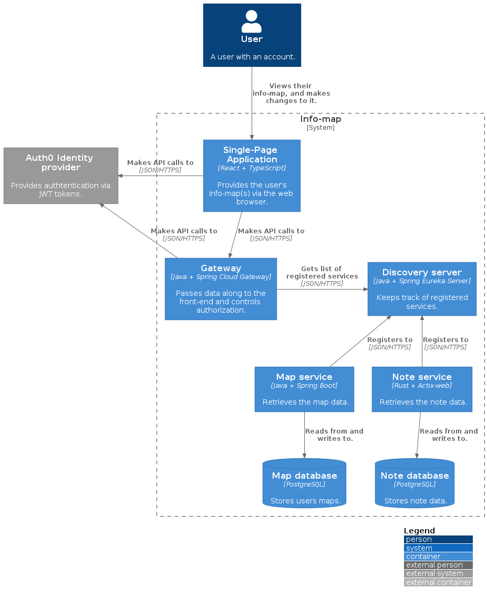
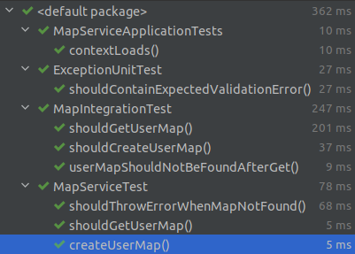
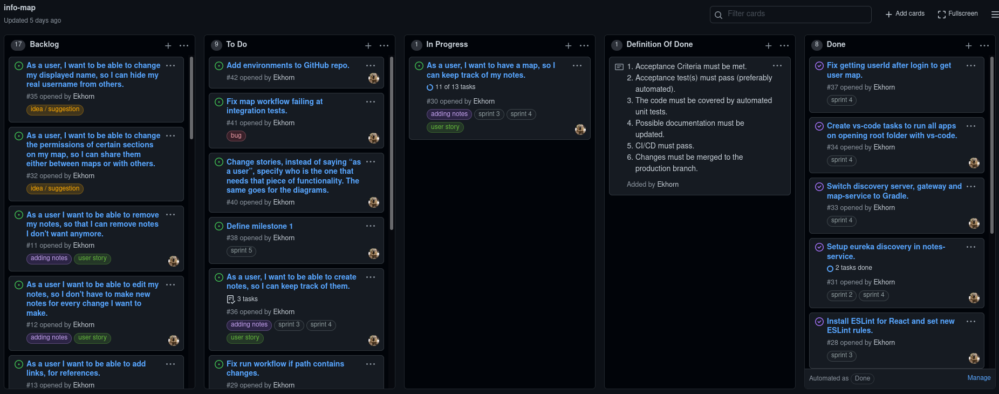
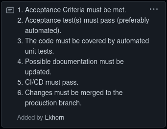
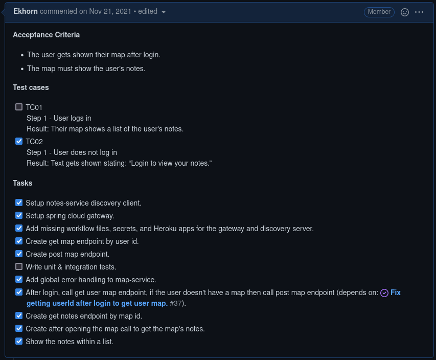
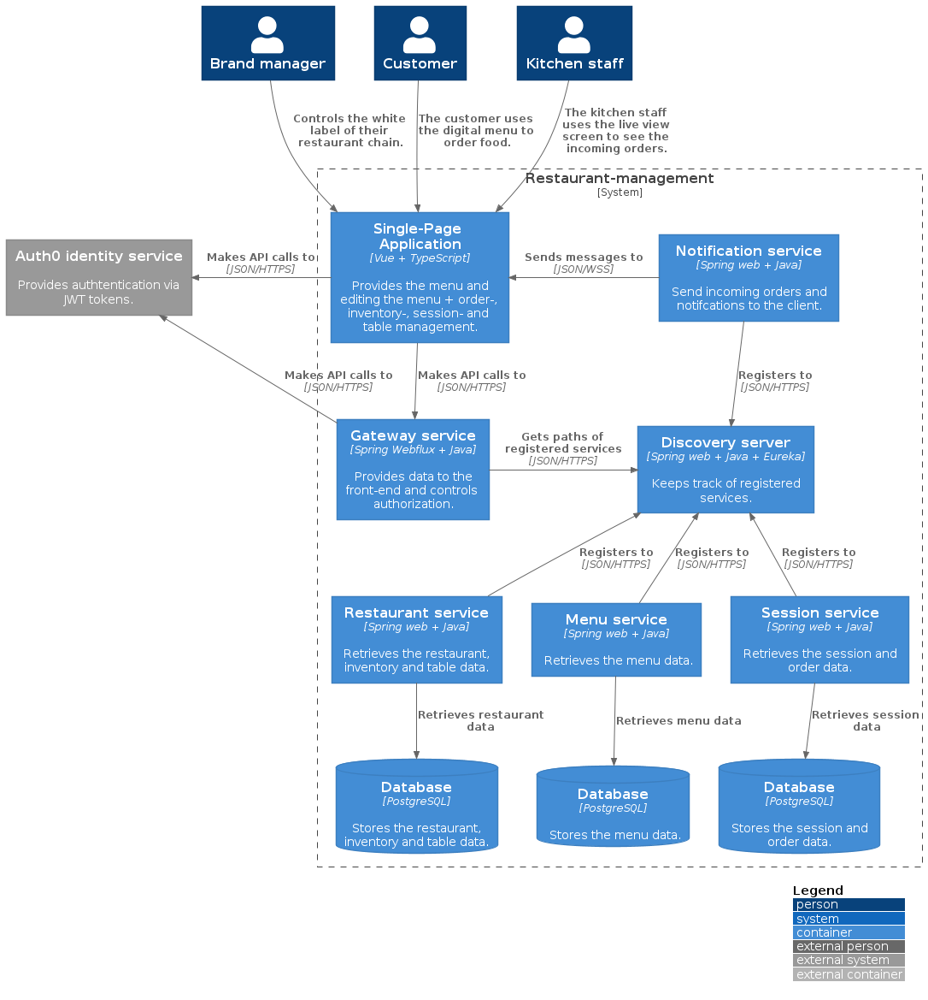

# My portfolio

## Table of contents
- [Learning outcomes](#Learning-outcomes)
  - [Individual project](#Individual-project)
    - [Web application](#Web-application_IP)
    - [Software quality](#Software-quality)
    - [CI/CD](#CI-CD)
    - [Professional](#Professional_IP)
  - [Group project](#Group-project)
    - [Agile method](#Agile-method)
    - [Business processes](#Business-processes)
    - [Requirements and Design](#Requirements-and-Design)
    - [Cultural differences and ethics](#Cultural-differences-and-ethics)
    - [Professional](#Professional_GP)
    - [Web application](#Web-application)
- [Reflection](#Reflection)

## Learning-outcomes

### Individual-project

#### Web-application

I made the following diagram to show how my project architecture was going to look.


One important thing to note right now is that security is being controlled by the micro-services instead of the gateway.

#### Software-quality

I wrote the following test for my map-service: [tests](code/ip/map-service/src/test)



#### CI-CD

**GitHub actions**
All of this projects workflows start like this. I set the workflow name and trigger it on a pull request to the production branch. I define a single job that both builds and deploys the application.
```
name: CI/CD
on:
  pull_request:
    branches: production
jobs:
  build-and-deploy:
    runs-on: ubuntu-latest
    steps:
```
After this however things start to look different. Because I have React client, Spring Boot service and a second service in Rust every application has to be build differently.
For the client that looks like:
```
    steps:
    - uses: actions/checkout@v2
    - uses: actions/setup-node@v1
    with:
      node-version: 12

    - name: Install node-modules
    run: npm ci

    - name: Build
    run: npm build
```
For the Spring Boot service:
```
    steps:
    - uses: actions/checkout@v2
    - name: Set up JDK 11
    uses: actions/setup-java@v2
      with:
        java-version: '11'
        distribution: 'adopt'
        cache: maven

    - name: Build with Maven
    run: mvn --update-snapshots verify
```
For the Rust service:
```
    steps:
    - uses: actions/checkout@v2
    - name: Update local toolchain
    run: |
      rustup update
      rustup install nightly

    - name: Toolchain info
    run: |
      cargo --version
      rustc --version
```
After this the workflows are pretty much the same only the --build-args are different. It builds the docker image, logs-in- and pushes to the remote registry and finally releases the new container.
```
    - name: Build Docker image
    run: docker build -t registry.heroku.com/${{ secrets.HEROKU_APP }}/web:latest
      --build-arg DOMAIN=${{ secrets.INFO_MAP_AUTH0_DOMAIN }}
      --build-arg AUDIENCE=${{ secrets.INFO_MAP_AUTH0_AUDIENCE }}
      --build-arg DB_URL=${{ secrets.DB_URL }}
      --build-arg DB_USERNAME=${{ secrets.DB_USERNAME }}
      --build-arg DB_PASSWORD=${{ secrets.DB_PASSWORD }} .

    - name: Docker image info
    run: docker images

    - name: Login to container registry
    env:
      HEROKU_API_KEY: ${{ secrets.HEROKU_API_KEY }}
    run: heroku container:login

    - name: Push Docker image
    run: docker push registry.heroku.com/${{ secrets.HEROKU_APP }}/web

    - name: Release
    env:
      HEROKU_API_KEY: ${{ secrets.HEROKU_API_KEY }}
    run: heroku container:release -a ${{ secrets.HEROKU_APP }} web
```

files: [client-pipeline](code/ip/.github/workflows/client-pipeline.yml), [map-service-pipeline](code/ip/.github/workflows/map-pipeline.yml), [notes-service-pipeline](code/ip/.github/workflows/notes-pipeline.yml), [discovery-server-pipeline](code/ip/.github/workflows/discovery-server-pipeline.yml), [gateway-pipeline](code/ip/.github/workflows/gateway-pipeline.yml)

**Dockerfiles**

As for my dockerfiles they're completely different to each other. My client and map-service both use just a single stage, which means that those final images are quite large and less secure, because there's a lot more tooling available on them. For my notes-service dockerfile I made use of a multistage process. First I get a base image with all the necessary tooling to build my app, and then I pull a new image which is very small. Then I copy everything over that's needed to run the application and start the application from ENTRYPOINT, because using CMD won't work without a shell.

files: [client-dockerfile](code/ip/client/dockerfile), [map-service-dockerfile](code/ip/map-service/dockerfile), [notes-service-dockerfile](code/ip/notes-service/dockerfile),
[discovery-server-dockerfile](code/ip/discovery-server/dockerfile),
[gateway-dockerfile](code/ip/gateway/dockerfile)

#### Professional_IP

**Feedback**


**Research**

For my other research you can find it here: [agile.md](research/agile.md)

I did the following research (for security) for my IP and it can be found here: [secure-docker-container.md](research/secure-docker-container.md)

For my other research you can find it here: [making-web-based-apps-faster.md](research/making-web-based-apps-faster.md)

**Project management**

I started of with project management in Jira, because I thought having proper sprints, a backlog and add-ons that can help with making stories like story mapping tools. Were going to be a superior experience to GitHub Projects. But after quite some time in Jira, and having to deal with constant switching between places like Jira, confluence and GitHub made want to try GitHub projects. After moving all my stories over I realized how much nicer it is to have everything in one place and that those features weren't really a necessity.

I started of with making a project board with the following columns: Backlog, To Do, In Progress, Definition of Done and Done. Then I made labels for my user stories, epics and sprints, as you can see below. 



I also compiled a list of criteria (my definition of done) which each story has to obey. 



After that I started writing acceptance criteria for my first story and test cases. I also while implementing started adding a todo list, which you can all find in my user story description.



### Group-project

#### Agile-method

I started this semester with Agile research for the project plan chapter 1.4 (Strategy).

_Here is our [strategy](research/agile.md)_

For are project strategy I looked into mostly everything of Scrum and a little bit of XP (mainly the core values of XP).

As for project management tools we went with Jira. Within Jira we used the following add-on ([easy-agile-user-story-maps](https://marketplace.atlassian.com/apps/1212078/easy-agile-user-story-maps-for-jira?hosting=datacenter&tab=overview)) for writing stories for our story map. 

By using story mapping it becomes easier to write down stories and covering the whole scope of the project. Here is are story map: 


Using this method it's important to take the approach where you follow the process the user goes threw when using the application. Every epic in our story map refers to a step/topic in that process. After those are defined you write down stories below them which describe what the user wants for that step and why (this should be done with the PO and in XP's case completely done by the PO). Ranging from most important to least important. 

Then the PO picks out the first couple of stories to do at the sprint planning meeting. And after that the development team adds subtasks to those stories to make them easier to implement. Here's an example of a story and it's subtasks I wrote during sprint 1:


As you can see in the picture above on the right hand side you can see the story point estimate. We trying to use this estimate so we can track the progress within Jira, but that isn't going well yet. As you can see here:


Were thinking of adding points or a time estimate to the subtasks. But ultimately I think we need get some more research done into testing and UI/UX, so the stories obey the definition of done.
<br>

#### Business-processes

I did the following business process research you can find it at the following link:
[Business process](research/business-process.md)

#### Requirements-and-Design

#### You have contributed to the requirements collection and elicitation.

    
#### You have contributed to the translation of the requirements to User stories. 


    
#### You have contributed to the translation of the requirements to the project architecture and designs. 



#### Cultural-differences-and-ethics

#### Professional_GP

#### Web-application

## Reflection
