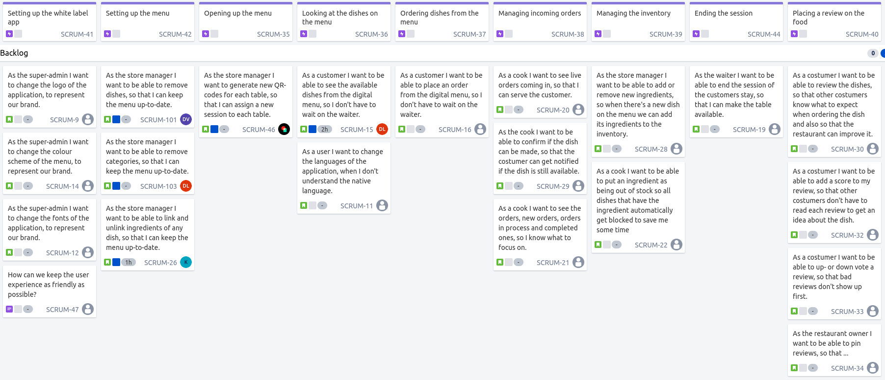
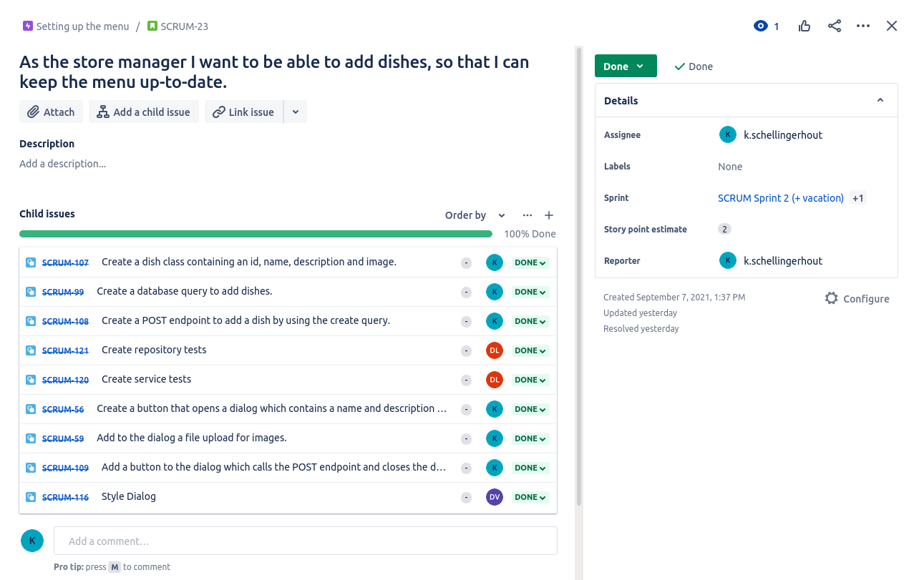
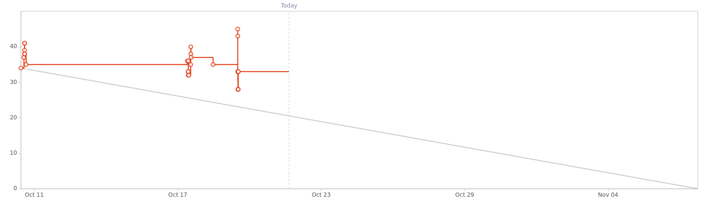

# My portfolio

## Table of contents
- [Semester 3](#Semester-3)
	- [Learning outcomes](#Learning-outcomes)
		- [Web application](#Web-application)
		- [Software quality](#Software-quality)
		- [CI/CD](#CI-CD)
		- [Professional](#Professional)
		- [Agile method](#Agile-method)
		- [Business processes](#Business-processes)
		- [Requirements and Design](#Requirements-and-Design)
		- [Cultural differences and ethics](#Cultural-differences-and-ethics)
	- [Research](#Research)
	- [Reflection](#Reflection)


<!--  -->

## Learning-outcomes

### Web-application

### Software-quality

### CI-CD

**GitHub actions**
All of this projects workflows start like this. I set the workflow name and trigger it on a pull request to the production branch. I define a single job that both builds and deploys the application.
```
name: CI/CD
on:
  pull_request:
    branches: production
jobs:
  build-and-deploy:
    runs-on: ubuntu-latest
    steps:
```
After this however things start to look different. Because I have React client, Spring Boot service and a second service in Rust every application has to be build differently.
For the client that looks like:
```
    steps:
    - uses: actions/checkout@v2
    - uses: actions/setup-node@v1
    with:
      node-version: 12

    - name: Install node-modules
    run: npm ci

    - name: Build
    run: npm build
```
For the Spring Boot service:
```
    steps:
    - uses: actions/checkout@v2
    - name: Set up JDK 11
    uses: actions/setup-java@v2
      with:
        java-version: '11'
        distribution: 'adopt'
        cache: maven

    - name: Build with Maven
    run: mvn --update-snapshots verify
```
For the Rust service:
```
    steps:
    - uses: actions/checkout@v2
    - name: Update local toolchain
    run: |
      rustup update
      rustup install nightly

    - name: Toolchain info
    run: |
      cargo --version
      rustc --version
```
After this the workflows are pretty much the same only the --build-args are different. It builds the docker image, logs-in- and pushes to the remote registry and finally releases the new container.
```
    - name: Build Docker image
    run: docker build -t registry.heroku.com/${{ secrets.HEROKU_APP }}/web:latest
      --build-arg DOMAIN=${{ secrets.INFO_MAP_AUTH0_DOMAIN }}
      --build-arg AUDIENCE=${{ secrets.INFO_MAP_AUTH0_AUDIENCE }}
      --build-arg DB_URL=${{ secrets.DB_URL }}
      --build-arg DB_USERNAME=${{ secrets.DB_USERNAME }}
      --build-arg DB_PASSWORD=${{ secrets.DB_PASSWORD }} .

    - name: Docker image info
    run: docker images

    - name: Login to container registry
    env:
      HEROKU_API_KEY: ${{ secrets.HEROKU_API_KEY }}
    run: heroku container:login

    - name: Push Docker image
    run: docker push registry.heroku.com/${{ secrets.HEROKU_APP }}/web

    - name: Release
    env:
      HEROKU_API_KEY: ${{ secrets.HEROKU_API_KEY }}
    run: heroku container:release -a ${{ secrets.HEROKU_APP }} web
```

<!-- files: [client-pipeline](.github/workflows/client-pipeline.yml), [map-service-pipeline](.github/workflows/map-pipeline.yml), [notes-service-pipeline](.github/workflows/notes-pipeline.yml) -->

**Dockerfiles**

As for my dockerfiles they're completely different to each other. My client and map-service both use just a single stage, which means that those final images are quite large and less secure, because there's a lot more tooling available on them. For my notes-service dockerfile I made use of a multistage process. First I get a base image with all the necessary tooling to build my app, and then I pull a new image which is very small. Then I copy everything over that's needed to run the application and start the application from ENTRYPOINT, because using CMD won't work without a shell.

<!-- files: [client-dockerfile](client/dockerfile), [map-service-dockerfile](map-service/dockerfile), [notes-service-dockerfile](notes-service/dockerfile) -->

### Professional

### Agile-method

<!-- I started this semester with Agile research for the project plan chapter 1.4 (Strategy).

_Here is our [strategy](research/agile.md)_

For are project strategy I looked into mostly everything of Scrum and a little bit of XP (mainly the core values of XP).

As for project management tools we went with Jira. Within Jira we used the following add-on ([easy-agile-user-story-maps](https://marketplace.atlassian.com/apps/1212078/easy-agile-user-story-maps-for-jira?hosting=datacenter&tab=overview)) for writing stories for our story map. 

By using story mapping it becomes easier to write down stories and covering the whole scope of the project. Here is are story map: 


Using this method it's important to take the approach where you follow the process the user goes threw when using the application. Every epic in our story map refers to a step/topic in that process. After those are defined you write down stories below them which describe what the user wants for that step and why (this should be done with the PO and in XP's case completely done by the PO). Ranging from most important to least important. 

Then the PO picks out the first couple of stories to do at the sprint planning meeting. And after that the development team adds subtasks to those stories to make them easier to implement. Here's an example of a story and it's subtasks I wrote during sprint 1:


As you can see in the picture above on the right hand side you can see the story point estimate. We trying to use this estimate so we can track the progress within Jira, but that isn't going well yet. As you can see here:


Were thinking of adding points or a time estimate to the subtasks. But ultimately I think we need get some more research done into testing and UI/UX, so the stories obey the definition of done.
<br> -->

### Business-processes

### Requirements-and-Design

### Cultural-differences-and-ethics

## Reflection


