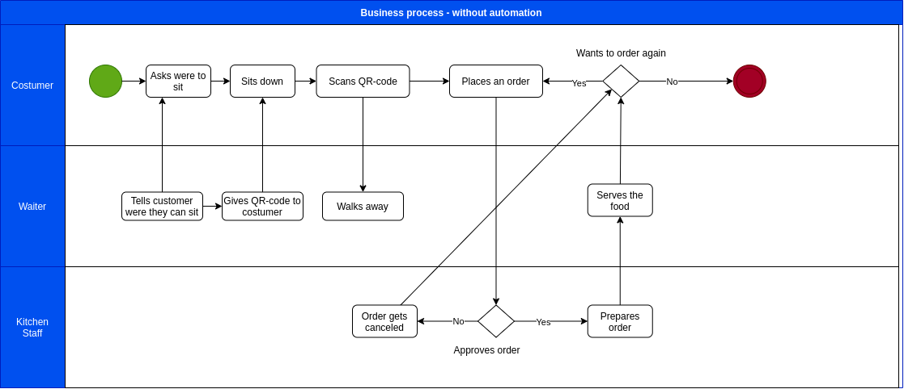

# Business process
## What is a business process?
To start of with answering what a business process is we first must know what a business is. Simply put a business is a organization, a group of people that work together to create value. Then in a business process you have people who are specialized (with assigned roles) to do specific activities in a sequence, meaning each person creates or changes something and passes it on to the next. This sequence has a beginning and an end, with sometimes so called gateways in between which represent certain decisions that may need to be made. Those gateways cause their to be multiple ways or so called branches to follow within a business process. A business process is often visualized with a flowchart.[1](#Sources)[2](#Sources)

## How a business process relates to software applications? 
It helps to make a business process of the current situation and then replacing the parts of the process with the software you're making to get a clear overview of what your application does within this process. This can help immensely when talking with stakeholders to find the best suitable activities to automate/replace by your software.

## Serving customers at a restaurant - business processes with and without our application
The following business processes represent what the business process is of a typical restaurant with and without are application being used.

### Which is the process that your software supports/automates? Can you visualize it in a diagram?

### Which steps of the process does your software support/automate? Can you visualize this in a diagram? 

### Does your software automate a task, facilitate a task, or make a new task possible to perform?
Are software automates the task of the customer to call the waiter; the waiter to take in the order and to pass it onto the Kitchen Staff.

### Which roles are involved in this process? The work of which people (their roles) will this software influence? 
Within a restaurant you typically have your customer a waiter and the kitchen staff. In the following section we will go over how these roles are influenced:
1. Customer

    When the customer scans the QR-code a session opens on their device and shows them the menu. The customer can now not only look at the menu, but also directly order from it. Making it so that the customer does not have to wait on the waiter anymore and can order whenever. Furthermore the customer will also get immediately notified on their device whenever their order gets canceled.

2. Waiter

    The waiter doesn't have to come to the table anymore whenever the customer wants to order something.

3. Kitchen Staff

    The kitchen staff will get real time updates when ever a order is placed, making it so that the kitchen staff has to communicate less with the waiter.

## Sources
1. [What is a business process - YouTube](https://www.youtube.com/watch?v=NXbGIilFidA)
2. [What is a business process - wikipedia](https://en.wikipedia.org/wiki/Business_process)
