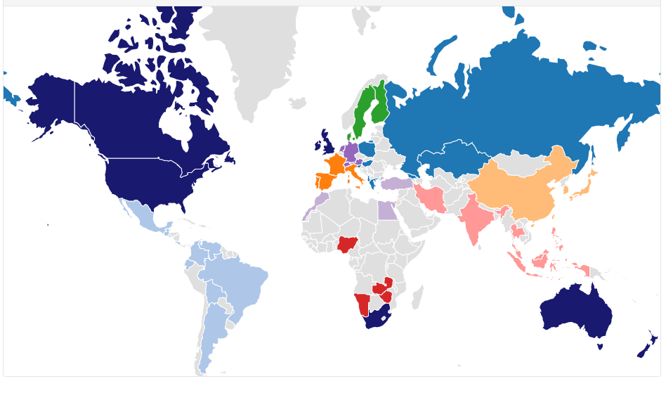
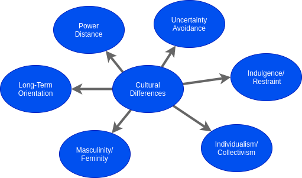
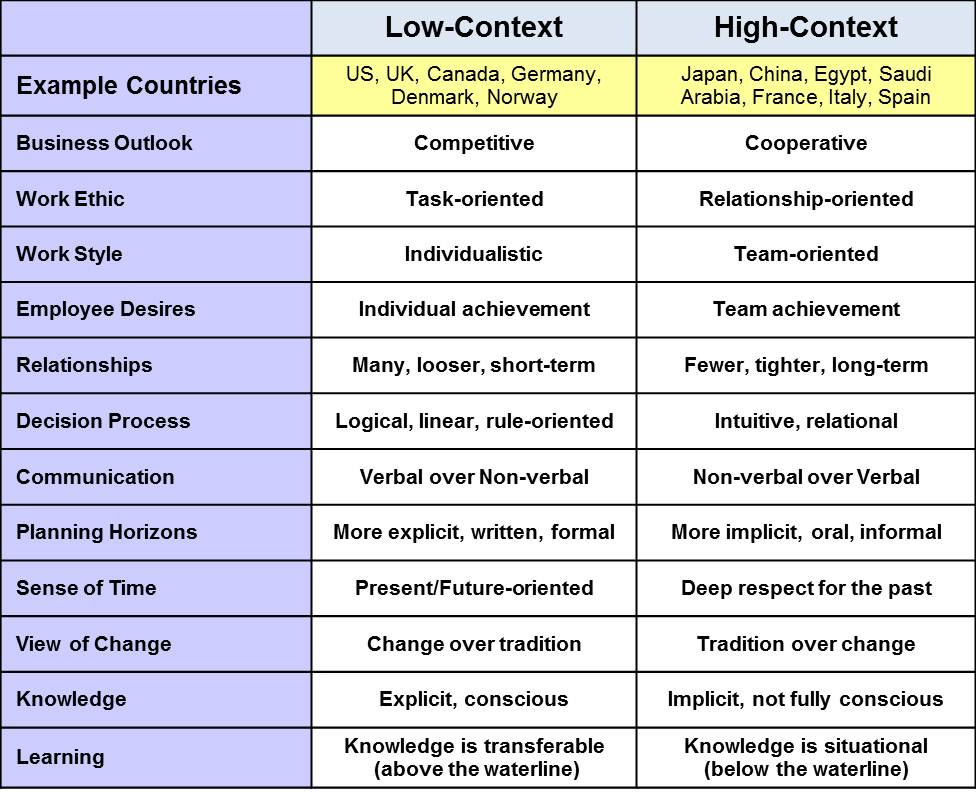
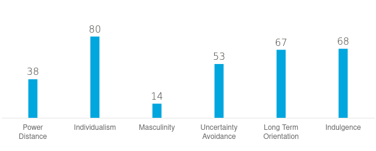

# Cultural differences and ethics
As a software engineer it's important to know what challenges you might face when dealing with cultural differences and the significance of ethics within the workspace. That's why I will be answering questions in the coming sections to prove I know the importance of this subject matter.

## Cultural differences
In the following section I will be talking about certain subjects and answering questions in terms of culture and cultural differences.

### What is culture? 
I would describe culture as follows: Culture is a so called umbrella term that encompasses the norms, values, beliefs, habits, and social behaviors of the members of a society. Culture sits somewhere in between personality and human nature and is learned when growing up.[1](#Sources)[2](#Sources)[3](#Sources)

### How can cultures be clustered?
To answer this I will first explain in short what cultural clusters even are. Cultural clusters are groupings of countries that closely relate by their characteristics. Cultural clusters are a way to learn cultural differences more efficiently.[4](#Sources)

In the following list you can see all the different cultural clusters and their characteristics. I will also add colors to each cluster to show what countries are included within each cluster.[5](#Sources)

- Anglo - competitive and result-oriented (Dark blue)
- Confucian Asia - result-driven, encourage group working together over individual goals (Light orange)
- Eastern Europe - forceful, supportive of co-workers, treat women with equality (Blue)
- Germanic Europe - value competition & aggressiveness and are more result-oriented (Purple)
- Latin America - loyal & devoted to their families and similar groups (light blue)
- Latin Europe - value individual autonomy (Orange)
- Middle East - devoted & loyal to their own people, women afforded less status (Light purple)
- Nordic Europe - high priority on long-term success, women treated with greater equality (Green)
- Southern Asia - strong family & deep concern for their communities (Pink)
- Sub-Sahara Africa - concerned & sensitive to others, demonstrate strong family loyalty. (Red)

The following image partially represents each of the cultural clusters.

### Cultural dimensions
Within Hofstede's Cultural Dimensions theory their are 6 dimensions each of them talking about different cultural values which they can be weighted by to find out the similarities between cultures.[6](#Sources)[7](#Sources)

### Cultural context
Cultural context gives us a more general overview of cultures then cultural cluster as displayed in the image below:

### What is your culture?
Being from the Netherlands the people are very direct. This can sometimes seem a bit harsh or difficult for more multi-active people. The culture I think definitely leans more towards a low-context culture and most people seem to be more linear-active.

In the following image you can see that the Dutch culture has a decently low power index, is very individualistic and that the people don't really care all that much about masculinity.

### Which cultural aspects would you keep in mind when facing cultural differences? 
I would definitely try to look more into the social behavior, values, norms and habits of someone with a different culture. I would try to engage with another culture like with cultural pluralism and try to learn from them. This way I hope to find out and better understand how to work more effectively together.

### Can you give examples for things going not as expected when interacting with people from other cultures? What and why it went differently?
When interacting for example with a person from a more reactive culture expecting them to take initiative or getting an immediate strong opinion on something, but not getting it can make you think they don't care or aren't as interested. But to them it's normal to wait and don't push anything to much, because it could be a bad idea.

###	How would you act in the future when you know that you need to communicate or collaborate with a person from another culture?
I would start of with finding out their nationality so I can find out what cultural cluster they are most likely related to. After that I would want to know a bit more about their personality and if their more of a linear-active, multi-active or reactive person. 

### What did you do to improve the group communications with respect to cultural differences? 
For communications in the group project I mainly focused on always talking english so everyone had a chance to give input. But this also helps with getting to know how a teammate from a different culture reacts and helps with finding out what the best way of communicating is. I also kind off unintentionally tabbed a bit more into high-context communication by helping out more and trying to get things done as a team.

## Ethics

### What is ethics in software engineering?
To understand what ethics are in software engineering. We should first answer what are ethics? As quoted by Potter Stewart[8](#Sources):
    
    "Ethics is knowing the difference between what you have a right to do and what is right to do."

Now what is ethics in software engineering? The following overview written by Gotterbarn, D. [9](#Sources) will explain what ethics in software engineering is.

    "Software engineering ethics can be approached from three directions. First, it can describe the activity of software engineers making practical choices that affect other people in significant ways. Second, it can be used to describe a collection of principles, guidelines, or ethical imperatives that guide or legislative action, and third, it can be used to name a discipline that studies the relationship between the other two senses of ethics. Software engineering ethics is clearly both an activity and a body of principles. The discipline of software engineering ethics that studies this activity and formalizes these principles, however, is in its infancy."

### Why is ethics important in software engineering? 
Software can both have a positive and negative impact on peoples lives. It can negatively effect peoples lives by for example making them addicted to the software or crossing privacy guidelines. This is why the ethical aspects of software are so important.

### What do you have to do as a software engineer to address ethical aspects in your work?
Software engineers should work in a professional manner by following 8 principles stated in the (Software Engineering Code of Ethics and Professional Practice) written by the ACM, summarized by Cast of Software [10](#Sources) :

    1. PUBLIC – Software engineers shall act consistently with the public interest.

    2. CLIENT AND EMPLOYER – Software engineers shall act in a manner that is in the best interests of their client and employer consistent with the public interest.

    3. PRODUCT – Software engineers shall ensure that their products and related modifications meet the highest professional standards possible.

    4. JUDGMENT – Software engineers shall maintain integrity and independence in their professional judgment.

    5. MANAGEMENT – Software engineering managers and leaders shall subscribe to and promote an ethical approach to the management of software development and maintenance.

    6. PROFESSION – Software engineers shall advance the integrity and reputation of the profession consistent with the public interest.

    7. COLLEAGUES – Software engineers shall be fair to and supportive of their colleagues.

    8. SELF – Software engineers shall participate in lifelong learning regarding the practice of their profession and shall promote an ethical approach to the practice of the profession.

### How do you know that your ethical considerations match with those of other software engineers? 
Talk with other software engineers to confirm if your ethical considerations match and compare each others views on the ACM principles. When in a team setting it's a good idea to have such a discussion atleast once.

### Which ethical aspects play a role in your project? 
Considering we have a PO/External stakeholder, a teacher, a team of 5 and potential users. I would say it would be in the best interest that we follow atleast the following principles summarized by the ACM: PUBLIC, CLIENT AND EMPLOYER, PRODUCT, COLLEAGUES and SELF.

### Do you foresee ethical conflicts caused by your software? What kind of?  
_To help answer this question I made an analysis of the ethical aspects of our application and used the TICT Tool provided by Fontys._

**Intended Solution:** Putting a QR-code on every table that can open up the menu, which can also be ordered from, should make the customer be more independent when ordering. Also another benefit for the costumer would be getting their food faster, because the kitchen will also have a live-view screen showing all the realtime orders coming in so they can prepare the customers food as soon as possible.

**Possible Stakeholders & Human Values**
1. The customer would need a mobile device to order from. 
2. The kitchen staff will have to work with a new system. This which will impact how they have to manage the orders.
3. The waiter will get less work to do which most likely will have a bad impact on their income.

**Privacy & Data:** The only possible privacy concern would be when a customer adds a comment to their order about any allergies or other sensitive information, because that will be saved together with the rest of their order. The reason for storing this data (which should only be stored for the length of the session) is actually in the customers favor. Because whenever something stops working the orders can just be retrieved again which guarantees that the customer won't get the wrong dish.

**Future Impact:** 
- In the utopian scenario the customer would have their benefits of getting their orders much quicker, while the waiters job would only change partially.
- In the dystopian scenario the waiters will all get fired from their jobs.

**Fairness & Bad Actors:** If the restaurant owners don't see a reason to keep their waiters employed than this would be unfair. But if they invest in a more flexible way of working for the waiters which lets them stay than this should be completely fair.

**Transparency:** By making it known to the PO how the system works and what the capabilities are we aim to be as transparent as possible.

So to conclude we have the following 2 possible conflicts that may need to be addressed.
1. Saving the order data with the customers comments. 
2. Having less work to do as waiters which could end up in them getting fired.

### Can you do something to avoid or minimize these conflicts? 
So knowing that there are 2 possible conflicts. 

To minimize these conflicts we can for the first one add a text saying: "Don't put any sensitive data in hear that you don't want to be saved". And for the second we can let the waiter control all the sessions from the table plan page.

## Sources
1. [What is culture? - whatisculture.org](https://whatisculture.org/)
2. [Culture - wikipedia](https://en.wikipedia.org/wiki/Culture)
3. [Intro to cultural differences - PowerPoint (canvas)](https://fhict.instructure.com/courses/11563/files/1432047/download?wrap=1)
4. [Explanation on cultural clusters](https://cultureplusconsulting.com/2015/03/24/mapping-cultural-distance-cultural-clusters/)
5. [List of cultural clusters with their characteristics](https://www.tlu.ee/~sirvir/IKM/Leadership%20Dimensions/characteristics_of_clusters.html)
6. [Cultural dimensions - PowerPoint (canvas)](https://fhict.instructure.com/courses/11563/files/1432046/download?wrap=1)
7. [Hofstede's cultural dimensions theory - wikipedia](https://en.wikipedia.org/wiki/Hofstede%27s_cultural_dimensions_theory)
8. [Ethics & Law starter slides - PowerPoint (canvas)](https://fhict.instructure.com/courses/11563/files/1431988/download?wrap=1)
9. [Software engineering ethics - pdf](https://citeseerx.ist.psu.edu/viewdoc/download?doi=10.1.1.99.5649&rep=rep1&type=pdf)
10. [Software Engineering Code - ACM](https://ethics.acm.org/code-of-ethics/software-engineering-code/)